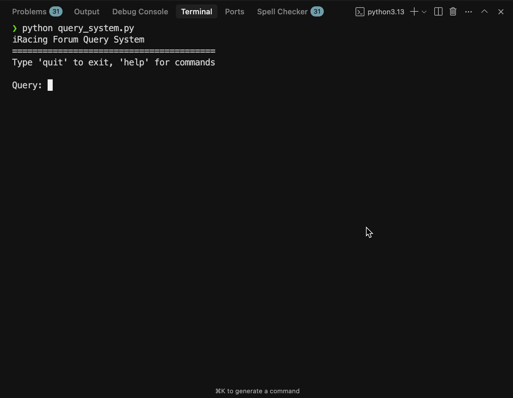

# iRacing SDK Query Chatbot

A simple system to scrape iRacing forums, store posts with embeddings, and query them using AI.

Demo:



## Features

- **Semantic Search**: Find relevant forum posts using sentence embeddings
- **AI-Powered Q&amp;A**: Ask questions and get answers based on forum content
- **Interactive CLI**: Easy-to-use command-line interface
- **Vector Search**: Uses Milvus for fast similarity search

## Setup

1. **Install dependencies**:
   ```bash
   uv sync
   ```

2. **Set your OpenAI API key** (choose one method):

   **Option A: Create a .env file** (recommended):
   ```bash
   echo "OPENAI_API_KEY=your-openai-api-key-here" > .env
   ```

   **Option B: Set environment variable**:
   ```bash
   export OPENAI_API_KEY="your-openai-api-key-here"
   ```

## Usage

### Running the Scraper

To scrape the forum posts and build the database you need to run the scraper.py file for the main and old forums. Once the browser initially loads, login, and the crawler will begin.

To run the scraper:

- For main forums:
  ```bash
  python scraper.py
  ```

- For JForum sections:
  ```bash
  python scraper.py jforum
  ```

### Interactive CLI

Run the interactive query system:

```bash
python query_system.py
```

Available commands:
- `ask <question>` - Ask a question about the forum posts
- `search <query>` - Search for similar posts
- `post <id>` - Get a specific post by ID
- `help` - Show available commands
- `quit` - Exit the program

### Example Usage

```python
from query_system import ForumQuerySystem

# Initialize the system
query_system = ForumQuerySystem(openai_api_key="your-key")

# Search for similar posts
posts = query_system.search_similar_posts("telemetry data", limit=5)

# Ask a question
answer = query_system.ask_question("How do I get started with the iRacing SDK?")

# Get a specific post
post = query_system.get_post_by_id(123)

# Don't forget to close the connection
query_system.close()
```

## How It Works

1. **Embeddings**: Each forum post is converted to a vector embedding using the `all-MiniLM-L6-v2` model
2. **Similarity Search**: When you search or ask a question, the system finds the most similar posts using Milvus vector search with cosine similarity
3. **Context Building**: Relevant posts are used as context for the OpenAI model
4. **AI Response**: GPT-5 generates answers based on the forum content

## Database Structure

The system uses a Milvus vector database with a collection named &#39;forum_posts&#39; containing fields like:
- id (auto-generated)
- vector (embedding)
- source
- author
- date
- text
- comment_id

## Files

- `scraper.py` - Entry point for forum scraping (wrapper for main and JForum scrapers)
- `main_forum_scraper.py` - Scraper for main iRacing forums
- `jforum_scraper.py` - Scraper for JForum sections
- `milvus.py` - Milvus utility functions for setup and saving posts
- `query_system.py` - Main query system and CLI interface
- `pyproject.toml` - Project dependencies and configuration
